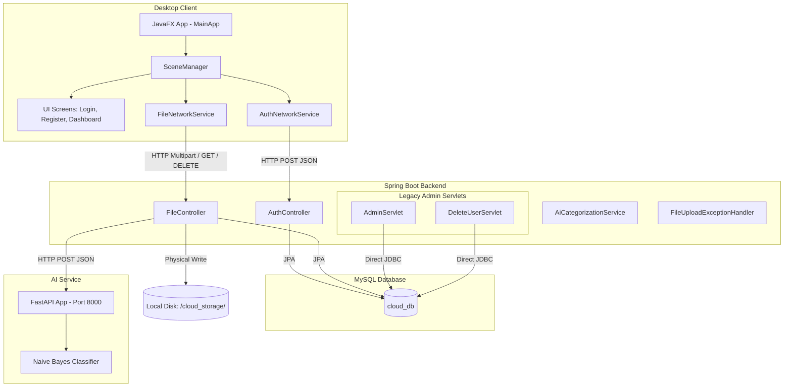

# 📂 mini_Drive

`mini_Drive` is a simplified, multi-component cloud drive system. It enables users to register, log in, upload, list, download, and delete files. The system features:
1. A **JavaFX Desktop Client** (Frontend).
2. A **Spring Boot REST & Jakarta Servlet Server** (Backend).
3. A **FastAPI AI Microservice** (Model) that uses a Naive Bayes classifier to automatically categorize uploaded files by their filename.

---

## 🏗️ System Architecture

Below is the conceptual architecture of `mini_Drive`, showing how the desktop client, backend server, MySQL database, and AI service interact.



---

## 📦 Component Details

### 1. Frontend (JavaFX Desktop Client)
- **Location:** [Cloud_Frontend_Workspace/frontend](file:///home/fallen/Git/mini_Drive/Cloud_Frontend_Workspace/frontend)
- **Tech Stack:** Java 11, JavaFX 13, Maven.
- **Key Modules & Files:**
  - [MainApp.java](file:///home/fallen/Git/mini_Drive/Cloud_Frontend_Workspace/frontend/src/main/java/com/minicloud/client/MainApp.java) — Application bootstrap launcher.
  - [SceneManager.java](file:///home/fallen/Git/mini_Drive/Cloud_Frontend_Workspace/frontend/src/main/java/com/minicloud/client/controllers/SceneManager.java) — Centralized controller managing transitions between login, register, and dashboard screens.
  - [AuthNetworkService.java](file:///home/fallen/Git/mini_Drive/Cloud_Frontend_Workspace/frontend/src/main/java/com/minicloud/client/network/AuthNetworkService.java) — Issues raw HTTP POST calls with manually built JSON bodies to authenticate or register users.
  - [FileNetworkService.java](file:///home/fallen/Git/mini_Drive/Cloud_Frontend_Workspace/frontend/src/main/java/com/minicloud/client/network/FileNetworkService.java) — Communicates with the backend for file operations, manually formatting multipart/form-data payloads.
  - **Screens:**
    - [LoginScreen.java](file:///home/fallen/Git/mini_Drive/Cloud_Frontend_Workspace/frontend/src/main/java/com/minicloud/client/ui/LoginScreen.java) — Sign-in layout.
    - [RegisterScreen.java](file:///home/fallen/Git/mini_Drive/Cloud_Frontend_Workspace/frontend/src/main/java/com/minicloud/client/ui/RegisterScreen.java) — Account creation layout.
    - [DashboardScreen.java](file:///home/fallen/Git/mini_Drive/Cloud_Frontend_Workspace/frontend/src/main/java/com/minicloud/client/ui/DashboardScreen.java) — Features a file grid showing filenames, sizes, types, and their AI-classified category.

### 2. Backend (Spring Boot Server)
- **Location:** [Cloud_Backend_Workspace/backend](file:///home/fallen/Git/mini_Drive/Cloud_Backend_Workspace/backend)
- **Tech Stack:** Spring Boot 4.0.3/3.x, Hibernate JPA, MySQL Connector, Jakarta Servlet.
- **Key Modules & Files:**
  - [BackendApplication.java](file:///home/fallen/Git/mini_Drive/Cloud_Backend_Workspace/backend/src/main/java/com/minicloud/server/backend/BackendApplication.java) — Bootstraps the server with Servlet Scanning enabled.
  - [AuthController.java](file:///home/fallen/Git/mini_Drive/Cloud_Backend_Workspace/backend/src/main/java/com/minicloud/server/backend/controllers/AuthController.java) — Handles credentials (plain-text checks).
  - [FileController.java](file:///home/fallen/Git/mini_Drive/Cloud_Backend_Workspace/backend/src/main/java/com/minicloud/server/backend/controllers/FileController.java) — Handles uploads, list query, downloads, and deletions.
  - [AiCategorizationService.java](file:///home/fallen/Git/mini_Drive/Cloud_Backend_Workspace/backend/src/main/java/com/minicloud/server/backend/services/AiCategorizationService.java) — Sends filename predictions to the Python AI service.
  - **Admin Panel (Servlets):**
    - [AdminServlet.java](file:///home/fallen/Git/mini_Drive/Cloud_Backend_Workspace/backend/src/main/java/com/minicloud/server/servlet/AdminServlet.java) — Uses direct JDBC to load all users into a simple HTML table. Renders [admin.html](file:///home/fallen/Git/mini_Drive/Cloud_Backend_Workspace/backend/src/main/resources/admin.html).
    - [DeleteUserServlet.java](file:///home/fallen/Git/mini_Drive/Cloud_Backend_Workspace/backend/src/main/java/com/minicloud/server/servlet/DeleteUserServlet.java) — Processes user deletion through direct JDBC query and redirects back to `/admin`.

### 3. AI Categorization Microservice
- **Location:** [model](file:///home/fallen/Git/mini_Drive/model)
- **Tech Stack:** Python 3, FastAPI, Uvicorn, Scikit-Learn.
- **Key Files:**
  - [app.py](file:///home/fallen/Git/mini_Drive/model/app.py) — Trains a Naive Bayes classifier using character n-grams (TF-IDF Vectorizer) on filenames and starts an API server on port 8000.
  - Predefined categories:
    - `Development & Code` (e.g. `.java`, `.py`, `.json`, `pom.xml`)
    - `Documents` (e.g. `.pdf`, `.docx`, `.xlsx`)
    - `Media & Assets` (e.g. `.jpg`, `.mp4`, `.mp3`)
    - `Archives & Backups` (e.g. `.zip`, `.tar.gz`)
    - `System Logs` (e.g. `.log`, `.ini`, `.cfg`)
    - `Executables & Installers` (e.g. `.exe`, `.msi`, `.sh`)

---

## 🛠️ Installation & Setup

### Prerequisites
- **Java JDK 17** (for the Backend)
- **Java JDK 11** (for the Frontend)
- **Python 3.8+** (for the AI Microservice)
- **MySQL Server** running locally

### 1. Database Setup
1. Open your MySQL terminal or database client.
2. Create a new database named `cloud_db`:
   ```sql
   CREATE DATABASE cloud_db;
   ```
3. Update database credentials in the backend's [application.properties](file:///home/fallen/Git/mini_Drive/Cloud_Backend_Workspace/backend/src/main/resources/application.properties) if your root password differs from the default `7317355`.

### 2. Run the AI Microservice
1. Navigate to the `model` folder.
2. Install Python dependencies:
   ```bash
   pip install fastapi uvicorn scikit-learn
   ```
3. Run the microservice:
   ```bash
   python app.py
   ```
   *The AI service will start on `http://127.0.0.1:8000`.*

### 3. Run the Spring Boot Backend
1. Navigate to `Cloud_Backend_Workspace/backend`.
2. Build and run the project:
   ```bash
   mvn spring-boot:run
   ```
   *The server will start on `http://localhost:8080`.*

### 4. Run the JavaFX Frontend Client
1. Navigate to `Cloud_Frontend_Workspace/frontend`.
2. Clean and run using Maven:
   ```bash
   mvn clean javafx:run
   ```

---

## 🔗 Key API Endpoints

### Backend REST Controller Endpoints (Spring Boot)

| Method | Endpoint | Description | Payload/Params | Response |
| :--- | :--- | :--- | :--- | :--- |
| **POST** | `/api/auth/register` | Register a new user | JSON: `{ "username": "...", "password": "..." }` | `201 Created` / `409 Conflict` |
| **POST** | `/api/auth/login` | Log in a user | JSON: `{ "username": "...", "password": "..." }` | `200 OK` / `401 Unauthorized` |
| **POST** | `/api/files/upload` | Upload a file | Multipart file (`file`) & string parameter (`username`) | `200 OK` (SUCCESS) / `500` |
| **GET** | `/api/files/list` | List files for user | Query Parameter: `?username=...` | Custom String (`id\|fileName\|...;;;`) |
| **GET** | `/api/files/download/{id}` | Download a file by ID | Path variable: `{id}` | Binary File Stream / `404` |
| **DELETE**| `/api/files/delete/{id}` | Delete file & metadata | Path variable: `{id}` | Plaintext message |

### Backend Servlet Endpoints (Direct JDBC)

| Method | Endpoint | Description |
| :--- | :--- | :--- |
| **GET** | `/admin` | Renders system administrator HTML view showing registered users count and detail table. |
| **POST** | `/admin/delete` | Deletes a user by ID and redirects back to `/admin`. |

### AI Microservice Endpoints (FastAPI)

| Method | Endpoint | Description | Payload | Response |
| :--- | :--- | :--- | :--- | :--- |
| **POST** | `/predict` | Predict file category | JSON: `{ "filename": "..." }` | JSON: `{ "category": "..." }` |
| **GET** | `/health` | Health check endpoint | None | JSON: `{ "status": "..." }` |

---

## 📝 Design Decisions & Known Issues

1. **Plain-Text Credentials**: Password hashing is not implemented. Passwords are saved and compared in plain-text inside the MySQL database.
2. **Hardcoded Configurations**: DB connection parameters are hardcoded inside the `application.properties` and Servlet files.
3. **Custom File List Protocol**: The file listing API does not use JSON. Instead, it returns a custom-encoded flat string delimited by `;;;` and `|` (e.g., `id|fileName|fileType|fileSize|category;;;`), which the frontend manually splits.
4. **Module Dependency Warning**: The Frontend's `module-info.java` only requests `javafx.controls` and `java.net.http`, though it exports layouts returning standard JavaFX objects. This triggers compilation accessibility warnings.
5. **Main Class Discrepancy**: The Frontend's Maven plugin is configured with `com.minicloud.client.App` as the main entry point, but the actual class in the repository is `com.minicloud.client.MainApp`. Running using the Maven plugin might require adjusting the launch configuration or updating the class references.